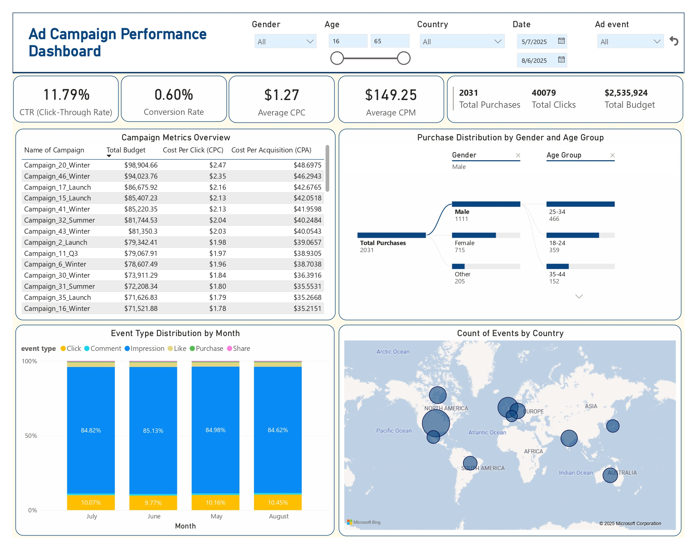
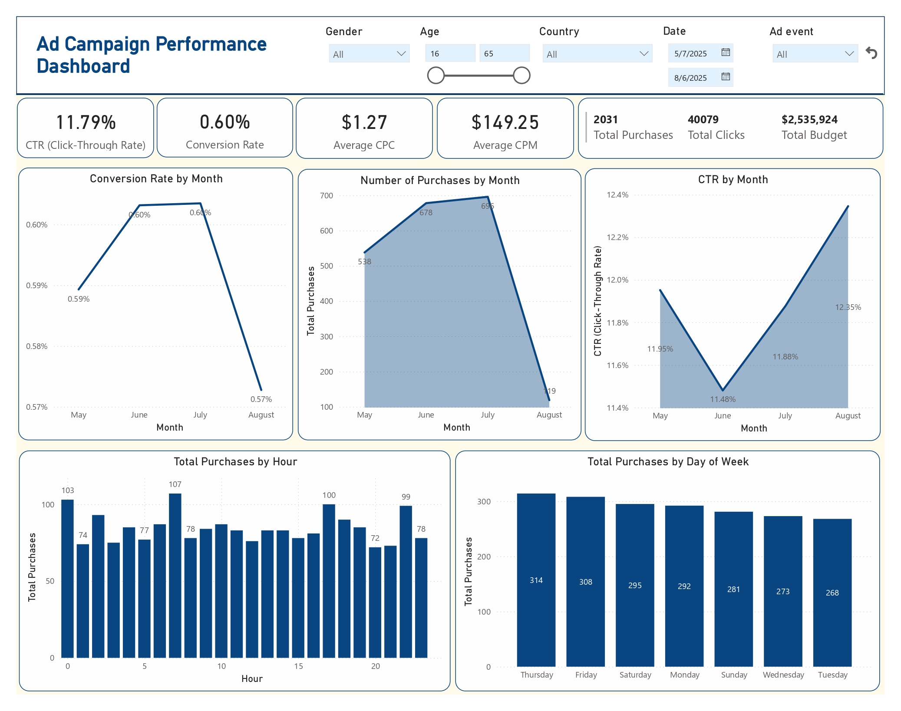
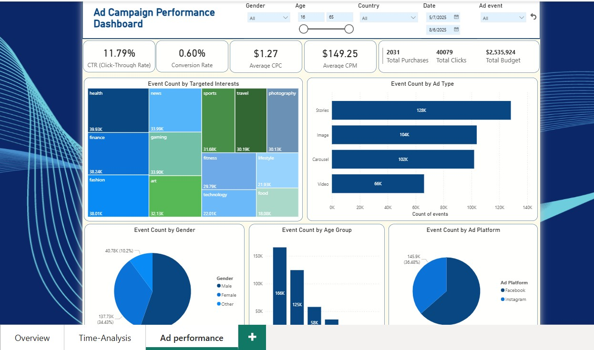
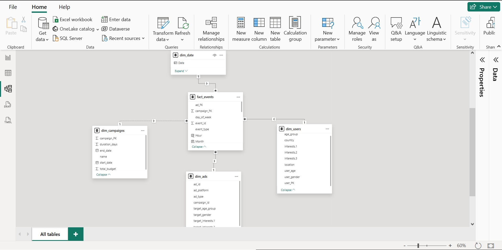
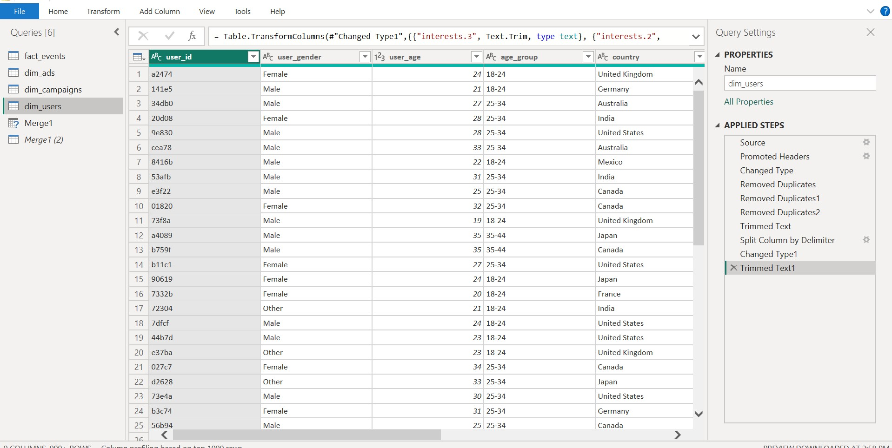
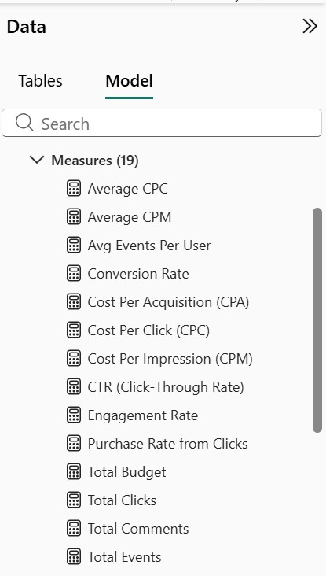
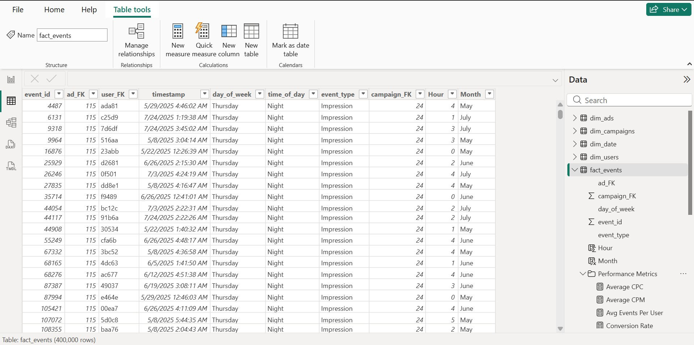

# Ad Campaign Performance Analysis with Power BI

A comprehensive Power BI analytics project analyzing digital advertising campaign performance across multiple platforms. This project transforms raw event-level data into an interactive business intelligence dashboard, providing actionable insights on campaign effectiveness, audience engagement, and conversion optimization.

---

## 📊 Project Overview

This project delivers a complete analysis of digital advertising campaigns running across Facebook and Instagram. Using event-level tracking data, the dashboard enables stakeholders to:

- Monitor key performance indicators including CTR, conversion rate, and cost metrics
- Analyze audience behavior across demographics, interests, and time patterns
- Evaluate campaign ROI and identify high-performing strategies
- Optimize ad spend allocation based on platform, format, and targeting effectiveness

The final deliverable is a 3-page interactive Power BI dashboard with advanced DAX measures and a fully normalized star schema data model.

---

## 🛠️ Methodology

This project was built end-to-end, starting with raw CSV data extraction and culminating in a production-ready BI solution.

### 1. Data Extraction
- **Source:** Kaggle advertising dataset containing event-level campaign data
- **Tables:** Multiple CSV files including ad events, user demographics, campaign details, and ad specifications

### 2. Data Cleaning & Transformation (Power Query)

Comprehensive data preparation was performed entirely in Power Query Editor:

**Data Type Configuration**
- Configured appropriate data types for all columns (dates, numbers, text)
- Ensured consistency across related tables for proper relationship mapping

**Duplicate Removal**
- Removed duplicates based on primary keys:
  - `event_id` in ad_events table
  - `user_id` in dim_users table
  - Similar validation across all dimension tables

**Text Standardization**
- Checked and corrected spelling errors across categorical columns
- Applied `TRIM()` function to eliminate unwanted leading/trailing spaces
- Standardized text casing for consistency

**Column Splitting for Multi-Value Fields**
- **Target Interests (ads table):** Split comma-separated interests into two columns (`target_interests` and `target_interests.2`)
- **User Interests (dim_users table):** Split into three separate columns to isolate individual interest values
- Used comma as delimiter for clean separation of values

**Schema Restructuring**
- Identified missing foreign key relationship between fact_events and dim_campaigns
- Merged dim_ads and fact_events tables on `ad_id` column
- Extracted `campaign_id` column and appended to fact table
- Retained only necessary columns post-merge to maintain clean schema

### 3. Data Modeling

Built a normalized **star schema** in Power BI Model View:

**Fact Table:**
- `fact_events` - Grain: one row per ad event (click, impression, purchase, etc.)

**Dimension Tables:**
- `dim_users` - User demographics and interests
- `dim_campaigns` - Campaign details and budgets
- `dim_ads` - Ad creative specifications and targeting
- `dim_date` - Time intelligence for temporal analysis

**Relationships:**
- Established one-to-many relationships from dimension tables to fact table
- Configured proper cardinality and cross-filter direction for optimal performance

### 4. DAX Measures & Calculations

Created a comprehensive library of DAX measures organized under a **"Performance Metrics"** folder within the fact_events table:

**Cost Efficiency Metrics:**
```dax
Average CPC = 
AVERAGEX(
    dim_campaigns,
    DIVIDE(
        dim_campaigns[total_budget],
        CALCULATE(
            COUNTROWS(fact_events),
            fact_events[event_type] = "Click"
        ),
        0
    )
)

Average CPM = 
AVERAGEX(
    dim_campaigns,
    DIVIDE(
        dim_campaigns[total_budget],
        CALCULATE(
            COUNTROWS(fact_events),
            fact_events[event_type] = "Impression"
        ) / 1000,
        0
    )
)

Cost Per Acquisition (CPA) = 
DIVIDE(
    [Total Budget],
    [Total Purchases],
    0
)
```

**Performance Indicators:**
```dax
CTR (Click-Through Rate) = 
DIVIDE(
    [Total Clicks],
    [Total Impressions],
    0
)

Conversion Rate = 
DIVIDE(
    [Total Purchases],
    [Total Impressions],
    0
)

Engagement Rate = 
DIVIDE(
    [Total Likes] + [Total Shares],
    [Total Impressions],
    0
)

Purchase Rate from Clicks = 
DIVIDE(
    [Total Purchases],
    [Total Clicks],
    0
)
```

**Base Measures:**
```dax
Total Budget = SUM(dim_campaigns[total_budget])

Total Clicks = 
CALCULATE(
    COUNTROWS(fact_events),
    fact_events[event_type] = "Click"
)

Total Purchases = 
CALCULATE(
    COUNTROWS(fact_events),
    fact_events[event_type] = "Purchase"
)

Avg Events Per User = 
DIVIDE(
    [Total Events],
    [Total Users],
    0
)
```

### 5. Dashboard Development

Designed and built a **3-page interactive dashboard** in Power BI Desktop:

**Page 1: Executive Overview**
- KPI cards displaying CTR, Conversion Rate, Average CPC, CPM, Total Purchases, and Budget
- Campaign performance table with CPC and CPA rankings
- Purchase distribution by gender and age group
- Event type distribution by month
- Geographic event count visualization

**Page 2: Temporal & Behavioral Analysis**
- Conversion rate and CTR trends by month
- Purchase patterns by day of week
- Monthly purchase volume comparison
- Hourly purchase distribution analysis

**Page 3: Audience & Channel Insights**
- Event distribution by targeted interests
- Platform performance comparison (Facebook vs Instagram)
- Gender distribution analysis
- Ad type effectiveness comparison (Stories, Image, Carousel, Video)
- Age group engagement breakdown

**Interactive Features:**
- Slicers for Gender, Age range, Country, Date range, and Ad event type
- Cross-filtering enabled across all visuals
- Drill-through capabilities for detailed analysis

---

## 💡 Key Insights & Findings

**Overall Performance (May - August 2025):**
- **CTR:** 11.79% - strong click engagement across campaigns
- **Conversion Rate:** 0.60% - 2,031 total purchases from 40,079 clicks
- **Average CPC:** $1.27 - cost-efficient click acquisition
- **Total Budget Spent:** $2.54M across all campaigns

**Campaign Efficiency:**
- Campaign_20_Winter had highest budget ($98.9K) but also highest CPA ($48.70)
- Lower-budget campaigns demonstrated better cost efficiency
- Top-performing campaign achieved $3.9 CPA

**Audience Insights:**
- Male users generated 54.7% of purchases (1,111 purchases)
- 25-34 age group is the highest converting demographic (848 purchases)
- Thursday and Friday show peak purchase activity (314 and 308 purchases respectively)

**Platform & Format Performance:**
- Facebook generated 63.52% of total events vs Instagram at 36.48%
- Stories format drove highest engagement (128K events)
- Peak purchase hours: 7 AM, 5 PM, and 10 PM (evening)

**Interest Targeting:**
- Health, finance, and fashion interests generated the highest event volumes at 39.93K, 38.24K, and 38.01K events, with 216, 203, and 192 sales respectively.

---

## 🎯 Business Recommendations

Based on the analysis, the following actions are recommended:

1. **Reallocate Budget:** Shift spend away from high-CPA campaigns (Campaign_20, Campaign_46) toward more efficient performers (Campaign_27_Q3, Campaign_42_Summer)
2. **Optimize Timing:** Increase ad spend on Thursdays and Fridays when conversion rates peak
3. **Demographic Focus:** Double down on 25-34 male demographic with tailored creative
4. **Platform Strategy:** Test reallocating some Facebook budget to Instagram given lower saturation
5. **Creative Format:** Prioritize Stories and Image formats which show highest engagement
6. **Interest Targeting:** Expand health, finance, and Fashion targeting based on strong performance
7. **Hourly Optimization:** Schedule high-value ads during 7 AM, 5 PM, and 10 PM peak conversion windows

---

## 📈 Dashboard Previews

**Dashboard Page 1 - Executive Overview**  


**Dashboard Page 2 - Time Analysis**  


**Dashboard Page 3 - Ad Insights**  


---

## 🗂️ Data Modeling Screenshots

**Star Schema Model**  


**Power Query Transformation Steps**  


**Campaign ID Merge Process**  


**DAX Measures Library**  


**Sample Data View**  


---

## 📂 Repository Files

- **powerBI-project_file.pbix** - Power BI project file with full data model and dashboard
- **Project_Dashboard.pdf** - Static PDF export of the complete 3-page dashboard
- **raw dataset.rar** - Original Kaggle dataset (multiple CSV files)
- **Screenshot_report_1.jpg** - Dashboard page 1 preview
- **Screenshot_report_2.jpg** - Dashboard page 2 preview
- **Screenshot_report_3.jpg** - Dashboard page 3 preview
- **datamodel.jpg** - Star schema relationship diagram
- **measures.jpg** - DAX measures library screenshot
- **power_query_steps.jpg** - Transformation steps in Power Query
- **Power_Query_Campaign_ID_Merge _Process.jpg** - Campaign ID merge process
- **data_sample.jpg** - Fact table data sample

---

## 💻 Tools Used

- **Power BI Desktop** - Data modeling, DAX development, and dashboard design
- **Power Query Editor** - ETL processes and data transformation
- **DAX (Data Analysis Expressions)** - Advanced calculated measures and KPIs

---

## 📓 Dataset

Source: [Kaggle - Digital Advertising Campaign Dataset](https://www.kaggle.com/datasets/alperenmyung/social-media-advertisement-performance)  

---

## 📄 License

This project is part of a personal portfolio and is available for educational and demonstration purposes.
